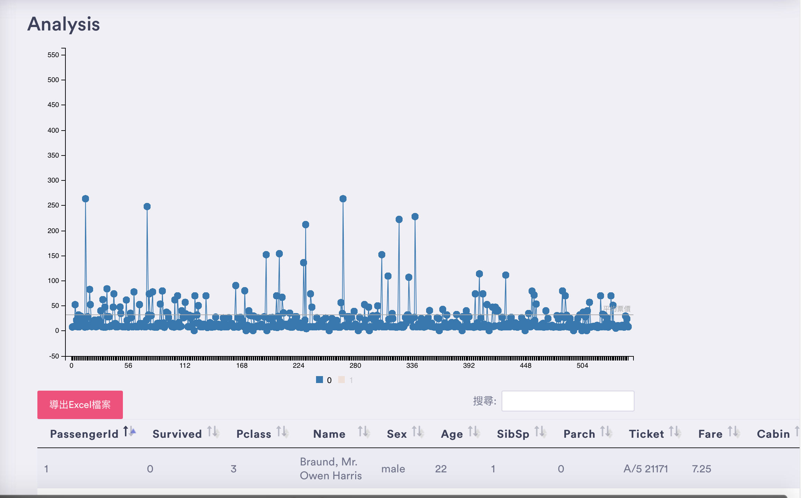
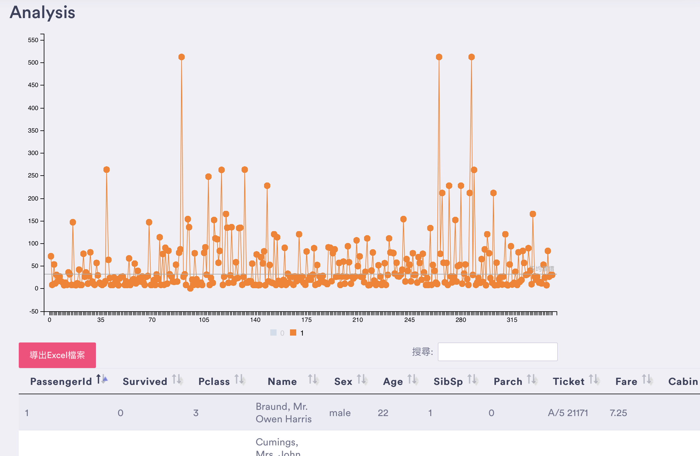

# TPMI_searchManagement


***This system can supply for search database***
***The following example uses case search as an example***


<a href=""></a>


## Table of Contents

- [Introduction](#introduction)
- [Install](#install)
- [function](#connection-options)
  - [create Admin account](#createAdmin-options)
  - [update FilterList](#updateFilterList-flags)
- [Analysis](#Analysis)
- [Todo](#todo)


## Introduction

* 此專案將提供搜尋的樣板以及分析的樣板。


## Install


Before installing, download and install [docker](https://www.docker.com) , docker-compose and Django [sqlite3 file](https://drive.google.com/file/d/1Lvtk0g6bjKr9brvTdsfL5NQmS79oJFdG/view?usp=sharing).


```sh
$ git clone https://github.com/skysora/TPMI_searchManagement
$ cd ./TPMI_searchManagement
$ docker-compose up --build
```
You cane access http://ip address:7777 預設帳號:root密碼:root
  
<a href=""></a>
## createAdmin-options

```sh
$ cd ./TPMI_searchManagement
$ python3 manage.py createsuperuser
```

## updateFilterList-flags

After you import table on database add your item and if you want more can reference [here](https://querybuilder.js.org)

$ vim ./TPMI_searchManagement/blog/templates/element/fliterList.html

```

Example:
```sh
{
  id: '疾病',
  label: '疾病',
  type: 'string',
  values: {
        <‘DatabasTableName’ : ‘欲顯示欄位名稱’>
  }
  operators: ['equal', 'not_equal', 'in']
 }
```
## Analysis
透過測試資料我可以從圖表中發現在鐵達尼號存活的人(1)票價比較高
<a href=""></a>
<a href=""></a>
## Todo


