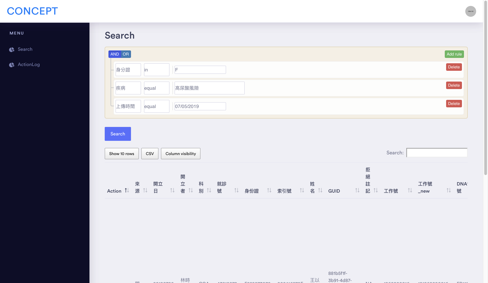

# TPMI_searchManagement


***This system can supply for search database***
***The following example uses case search as an example***


<a href=""></a>


## Table of Contents

- [Install](#install)
- [Introduction](#introduction)
- [Establishing connections](#establishing-connections)
- [function](#connection-options)
  - [SSL options](#ssl-options)
  - [Connection flags](#connection-flags)
- [Todo](#todo)

## Install

This is a [Node.js](https://nodejs.org/en/) module available through the
[npm registry](https://www.npmjs.com/).

Before installing, [download and install Node.js](https://nodejs.org/en/download/).
Node.js 0.6 or higher is required.

Installation is done using the
[`npm install` command](https://docs.npmjs.com/getting-started/installing-npm-packages-locally):

```sh
$ npm install mysql
```

For information about the previous 0.9.x releases, visit the [v0.9 branch][].

Sometimes I may also ask you to install the latest version from Github to check
if a bugfix is working. In this case, please do:

```sh
$ npm install mysqljs/mysql
```

[v0.9 branch]: https://github.com/mysqljs/mysql/tree/v0.9

